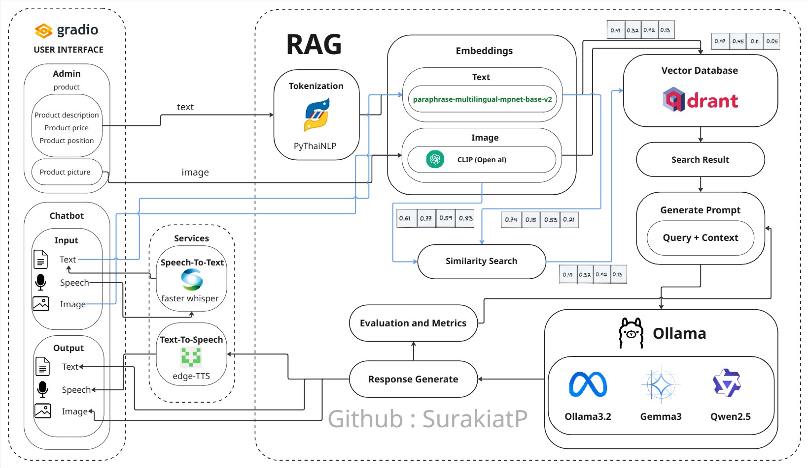
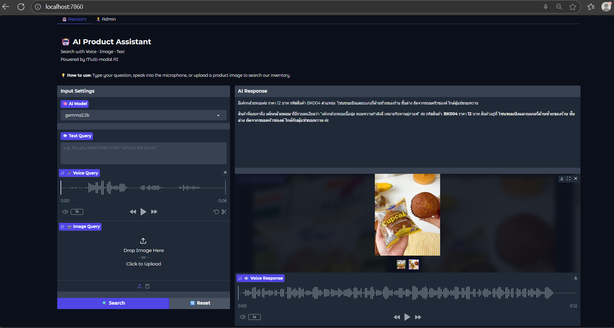
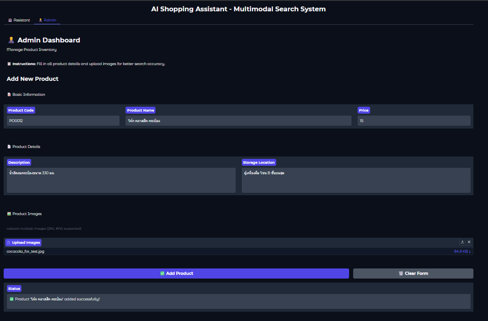
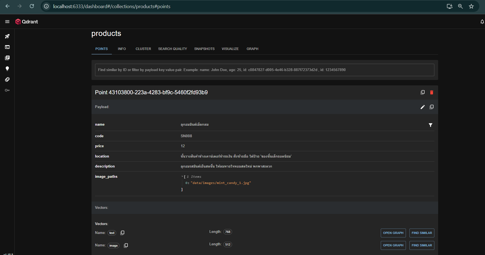

# Multi-modal-RAG - AI-Powered Product Search System

<div align="center">


An intelligent AI-powered shop assistant that helps customers find products through text, voice, and image queries using Retrieval-Augmented Generation (RAG) technology.

[Features](#features) • [Demo](#screenshots) • [Installation](#installation--setup) • [Usage](#how-it-works) • [Evaluation](#evaluation-metrics)

</div>

---

## Table of Contents

- [Project Overview](#project-overview)
- [Features](#features)
- [Project Structure](#project-structure)
- [System Architecture](#system-architecture)
- [Screenshots](#screenshots)
- [Technologies Used](#technologies-used)
- [Ollama Models](#ollama-models)
- [Qdrant Installation](#qdrant-installation-docker)
- [Installation & Setup](#installation--setup)
- [How It Works](#how-it-works)
- [Evaluation Metrics](#evaluation-metrics)
- [Author](#author)
- [License](#license)

---

## Project Overview

**Multi-modal RAG** is an advanced AI solution that acts as a smart shop assistant, enabling customers to search for products in multiple ways:

- **Text queries** - Type questions naturally
- **Voice queries** - Speak to search (Speech-to-Text)
- **Image queries** - Upload product images for visual search

The system combines vector search (Qdrant), multi-modal embeddings (CLIP, MPNet), local LLMs (Ollama), and text-to-speech synthesis to provide natural, conversational responses with product information, images, and audio output.

### Key Features

- Multi-modal input (text, voice, image)
- Semantic search using vector embeddings
- Local LLM inference (privacy-focused)
- Real-time response streaming
- Text-to-speech output
- Admin panel for product management
- GPU acceleration support
- Thai language support

---

## Features

### For Customers

- **Convenient Search**: Find products easily without walking around the store
- **Fast Response**: Instant search and response in seconds
- **Intelligent Understanding**: Comprehends text, voice, and image queries
- **Natural Interaction**: Conversational responses with audio feedback
- **Multi-language Support**: Supports Thai and English seamlessly

### For Shop Owners

- **Easy Management**: Simple product registration interface
- **Scalable System**: Handles large product catalogs efficiently
- **Privacy-Focused**: Local LLM processing (no cloud data transfer)
- **Cost-Effective**: Built on open-source components
- **Analytics Ready**: Track customer queries and product popularity

---

## Project Structure
```
MULTIMODAL SHOP HELPER/
│
├── .gradio/                    # Gradio cache
├── cache/                      # Application cache
│   ├── qdrant_storage/         # Qdrant vector database storage
│   └── tts_cache/              # Text-to-speech audio cache
│
├── data/                       # Product data
│   ├── images/                 # Product images
│   └── products.json           # Product database (JSON)
│
├── src/                        # Source code
│   │
│   ├── database/               # Database layer
│   │   ├── __init__.py
│   │   ├── product_loader.py  # Load products from JSON
│   │   └── qdrant_client.py   # Qdrant operations
│   │
│   ├── models/                 # ML models
│   │   ├── __init__.py
│   │   ├── embeddings.py      # CLIP & MPNet embeddings
│   │   └── llm.py             # Ollama LLM interface
│   │
│   ├── services/               # Business logic
│   │   ├── __init__.py
│   │   ├── query_expansion.py # Query expansion with synonyms
│   │   ├── response.py        # Response generation
│   │   ├── search.py          # Search orchestration
│   │   ├── stt.py             # Speech-to-text (Whisper)
│   │   └── tts.py             # Text-to-speech
│   │
│   ├── ui/                     # User interface
│   │   ├── __init__.py
│   │   ├── admin.py           # Admin panel (Gradio)
│   │   └── chatbot.py         # Chatbot interface (Gradio)
│   │
│   └── config.py               # Configuration settings
│
├── evaluate_system.py          # System evaluation script
├── evaluation_results.json     # Evaluation metrics output
├── main.py                     # Application entry point
├── README.md                   # Project documentation
└── requirements.txt            # Python dependencies
```

---

## System Architecture



### Architecture Components

#### 1. Frontend Layer (Gradio UI)

**Chatbot Interface**: Customer-facing interface
- Text input field
- Voice recording (microphone)
- Image upload
- LLM model selector
- Response display (text, images, audio)

**Admin Panel**: Product management interface
- Product information form
- Multi-image upload
- Product listing

#### 2. Processing Layer

**Input Processing:**
- Text: Direct processing
- Voice: Faster-Whisper (STT) → Text
- Image: CLIP encoder → Image embedding

**Embedding Generation:**
- Text: Paraphrase Multilingual MPNet (768-dim vectors)
- Image: CLIP ViT-B/32 (512-dim vectors)

**Query Expansion**: Synonym expansion for better retrieval

#### 3. Retrieval Layer (Qdrant)

- Vector database for semantic search
- Dual vector spaces (text + image)
- Cosine similarity matching
- Returns top-K similar products

#### 4. Generation Layer (Ollama)

- Local LLM for response generation
- Streaming responses
- Context-aware answers using retrieved products

#### 5. Output Layer

- Text: Markdown-formatted response
- Images: Product gallery display
- Audio: TTS synthesis (edge-tts)

---

## Screenshots

### 1. Gradio Interface

#### Chat Interface



- LLM model dropdown selector
- Text input field
- Microphone button for voice input
- Image upload area
- Response display area
- Product image gallery
- Audio player

**Features:**
- **Model Selection**: Choose from available Ollama models (llama3.2:1b, gemma2:2b, qwen2.5:0.5b)
- **Multi-modal Input**: Text, voice recording, or image upload
- **Rich Output**: Text responses, product images, and audio playback

#### Admin Panel



- Product code input
- Product name field
- Description textarea
- Price input
- Location textarea
- Multiple image upload
- Add/Clear buttons
- Status messages

**Features:**
- Add new products with detailed information
- Upload multiple product images
- Real-time status feedback

### 2. Qdrant UI Dashboard



- Collections list
- Vector dimensions (text: 768, image: 512)
- Point count
- Distance metrics (Cosine)
- Collection details

Access at: `http://localhost:6333/dashboard`

---

## Technologies Used

<div align="center">

### Core Technologies

| Technology | Description | Badge |
|------------|-------------|-------|
| **Python 3.10** | Programming language |  |
| **Gradio** | Web UI framework |  |
| **PyTorch** | Deep learning framework |  |
| **Qdrant** | Vector database |  |
| **Ollama** | Local LLM runtime |  |

### AI/ML Models

| Model | Purpose | Badge |
|-------|---------|-------|
| **CLIP (ViT-B/32)** | Image embeddings |  |
| **Paraphrase Multilingual MPNet** | Text embeddings |  |
| **Faster-Whisper** | Speech-to-text |  |
| **Edge-TTS** | Text-to-speech |  |
| **Llama 3.2** | Language model |  |
| **Gemma 2** | Language model |  |
| **Qwen 2.5** | Language model |  |

### Python Libraries

| Library | Purpose | Badge |
|---------|---------|-------|
| **sentence-transformers** | Embedding models |  |
| **transformers** | HuggingFace models |  |
| **qdrant-client** | Qdrant Python SDK |  |
| **pythainlp** | Thai NLP |  |
| **Pillow** | Image processing |  |

</div>

---

## Ollama Models

The system supports multiple local LLM models through Ollama:

<div align="center">

| Model | Size | VRAM | Speed | Accuracy | Best For |
|-------|------|------|-------|----------|----------|
|  | 1B | ~1.3GB | Very Fast | High | CPU / 4GB GPU |
|  | 2B | ~2GB | Fast | High | 4GB+ GPU |
|  | 0.5B | ~0.5GB | Fastest | Good | CPU |

</div>

### Installing Ollama Models
```bash
# Download models
ollama pull llama3.2:1b
ollama pull gemma2:2b
ollama pull qwen2.5:0.5b

# Verify installation
ollama list

# Test a model
ollama run llama3.2:1b "Hello, how are you?"
```

**Note:** The system automatically selects the first available model from the configured list in `src/config.py`.

---

## Qdrant Installation (Docker)

### Prerequisites

- Docker Desktop installed and running
- Minimum 2GB free RAM
- Port 6333 available

### Quick Start

#### Using Docker CLI
```bash
# Pull Qdrant image
docker pull qdrant/qdrant

# Run Qdrant container
docker run -d \
  --name qdrant \
  -p 6333:6333 \
  -p 6334:6334 \
  -v $(pwd)/cache/qdrant_storage:/qdrant/storage \
  qdrant/qdrant
```

### Verification

- **REST API**: `http://localhost:6333`
- **Web Dashboard**: `http://localhost:6333/dashboard`
- **Health Check**: `http://localhost:6333/health`

---

## Installation & Setup

### System Requirements

- **OS**: Windows 10/11, macOS, or Linux
- **Python**: 3.10 or 3.11
- **RAM**: Minimum 8GB (16GB recommended)
- **GPU** (Optional): NVIDIA GPU with CUDA support (4GB+ VRAM)
- **Disk**: ~10GB free space for models

### Step 1: Clone Repository
```bash
git clone https://github.com/SurakiatP/Multi-modal-RAG.git
cd Multi-modal-RAG
```

### Step 2: Create Virtual Environment
```bash
# Create venv
python -m venv .venv

# Activate venv
# Windows
.venv\Scripts\activate

# macOS/Linux
source .venv/bin/activate
```

### Step 3: Install Dependencies
```bash
# Upgrade pip
pip install --upgrade pip

# Install requirements
pip install -r requirements.txt

# For GPU support (CUDA 11.8)
pip install torch torchvision torchaudio --index-url https://download.pytorch.org/whl/cu118
```

### Step 4: Install Ollama

**Windows/macOS:**
- Download from: https://ollama.ai/download
- Run installer

**Linux:**
```bash
curl -fsSL https://ollama.ai/install.sh | sh
```

**Pull Models:**
```bash
ollama pull llama3.2:1b
ollama pull gemma2:2b
```

### Step 5: Start Qdrant
```bash
# Using Docker Compose
docker-compose up -d

# Verify
curl http://localhost:6333/health
```

### Step 6: Configure Application

Edit `src/config.py` if needed:
```python
# Qdrant settings
QDRANT_HOST = "localhost"
QDRANT_PORT = 6333

# Model settings
CLIP_MODEL_NAME = "openai/clip-vit-base-patch32"
TEXT_EMBEDDING_MODEL = "sentence-transformers/paraphrase-multilingual-mpnet-base-v2"
WHISPER_MODEL_SIZE = "small"

# Ollama models
AVAILABLE_OLLAMA_MODELS = ["llama3.2:1b", "gemma2:2b"]
```

### Step 7: Run Application
```bash
# Initialize and start
python main.py
```

The application will:
1. Load embedding models (CLIP, MPNet)
2. Initialize Qdrant collection
3. Embed products from `data/products.json`
4. Launch Gradio interface

**Access:**
- Gradio UI: `http://127.0.0.1:7860`
- Qdrant Dashboard: `http://localhost:6333/dashboard`

### Step 8: Evaluate System (Optional)
```bash
python evaluate_system.py
```

This will test:
- Retrieval precision and recall
- MRR (Mean Reciprocal Rank)
- Response latency
- Embedding quality

---

## How It Works

### System Workflow

#### **Phase 1: Admin Panel - Product Registration**

**Purpose:** Product database setup

**Process:**

1. Shop owner accesses Admin Panel
2. Enters product details:
   - Product code (e.g., "FD004")
   - Name (e.g., "Garlic Chicken Rice Box")
   - Description
   - Price
   - Location in store (e.g., "Fridge Zone A, Top Shelf")
3. Uploads product images (multiple images supported)
4. System generates embeddings:
   - **Text embedding**: Name + Description + Tags → MPNet Model → 768-dim vector
   - **Image embedding**: Product images → CLIP Model → 512-dim vector
5. Embeddings stored in **Qdrant** vector database

**Result:** Product data ready for semantic search

---

#### **Phase 2: Customer Chatbot - Query Processing**

**Step 1: Customer Input (Multi-modal)**

**Option A: Text Query**
```
Customer types: "Where can I find fresh milk?"
→ Direct text processing
```

**Option B: Voice Query**
```
Customer speaks: "Where is fresh milk?"
→ Faster-Whisper (STT) → "Where is fresh milk?" (text)
```

**Option C: Image Query**
```
Customer uploads: [product_image.jpg]
→ CLIP encoder → 512-dim image vector
```

---

**Step 2: Query Embedding**
```python
# Text/Voice queries
query_text = "fresh milk"
query_embedding = MPNet_model.encode(query_text)  # 768-dim vector

# Image queries
image = load_image("product.jpg")
query_embedding = CLIP_model.encode(image)  # 512-dim vector
```

---

**Step 3: Vector Search in Qdrant**
```python
# Semantic search
results = qdrant.search(
    collection="products",
    query_vector=query_embedding,
    vector_name="text",  # or "image"
    limit=3,  # Top 3 products
    score_threshold=0.7
)
```

**Qdrant performs:**
- Cosine similarity calculation
- Returns top-K most similar products
- Includes product metadata (name, location, price, images)

**Example Result:**
```json
[
  {
    "name": "Fresh Milk 500ml",
    "location": "Fridge Zone A, Bottom Shelf",
    "price": 35,
    "images": ["milk1.jpg", "milk2.jpg"],
    "similarity_score": 0.92
  },
  {
    "name": "Chocolate Milk 250ml",
    "location": "Fridge Zone A, Middle Shelf",
    "price": 25,
    "images": ["choco_milk.jpg"],
    "similarity_score": 0.85
  }
]
```

---

**Step 4: Response Generation (Ollama LLM)**

**Context Construction:**
```python
context = f"""
Product 1: Fresh Milk 500ml
- Location: Fridge Zone A, Bottom Shelf
- Price: 35 THB

Product 2: Chocolate Milk 250ml
- Location: Fridge Zone A, Middle Shelf
- Price: 25 THB
"""

prompt = f"""
Based on the products below, answer the customer's question naturally.

{context}

Customer question: "Where can I find fresh milk?"

Answer:
"""
```

**LLM Processing:**
```python
response = ollama.generate(
    model="llama3.2:1b",
    prompt=prompt,
    stream=True  # Real-time streaming
)
```

**Generated Response (Streaming):**
```
"I found fresh milk for you! It's located in Fridge Zone A 
on the Bottom Shelf, priced at 35 THB. We also have Chocolate 
Milk nearby in the same zone if you're interested."
```

---

**Step 5: Text-to-Speech Synthesis**
```python
# Convert response to audio
tts = edge_tts.Communicate(
    text=response_text,
    voice="th-TH-PremwadeeNeural"
)

await tts.save("response.mp3")
```

---

**Step 6: Output to Customer**

The system displays:

1. **Text Response** (Markdown, streaming)
```
   I found fresh milk for you! It's located in 
   Fridge Zone A on the Bottom Shelf...
```

2. **Product Images** (Gallery)
```
   [milk1.jpg] [milk2.jpg] [choco_milk.jpg]
```

3. **Audio Playback** (Autoplay)
```
   [response.mp3 playing...]
```

---

### Complete Flow Diagram
```
Customer Input
     ↓
[Text] → Direct Processing
[Voice] → STT (Whisper) → Text
[Image] → CLIP Encoder → Image Vector
     ↓
Query Embedding (MPNet / CLIP)
     ↓
Vector Search (Qdrant)
  → Cosine Similarity
  → Top-K Results
     ↓
Retrieved Products (Context)
     ↓
LLM (Ollama) + Prompt
  → Generate Natural Response
     ↓
Text-to-Speech (Edge-TTS)
     ↓
Output Display
  ├─ Text (Streaming)
  ├─ Images (Gallery)
  └─ Audio (Autoplay)
```

---

## Evaluation Metrics

Run system evaluation:
```bash
python evaluate_system.py
```

### Metrics Explained

<div align="center">

| Metric | Description | Target |
|--------|-------------|--------|
| **Precision@3** | Percentage of relevant products in top 3 results | > 0.7 |
| **Recall@3** | Percentage of all relevant products found | > 0.7 |
| **MRR** | Average rank of first correct result | > 0.8 |
| **Latency** | Response time (seconds) | < 3s |
| **Embedding Separation** | Vector space quality | > 0.2 |

</div>

**Sample Output:**
```
============================================================
SUMMARY
============================================================
Average Precision@3: 0.867 [PASS]
Average Recall@3: 0.933 [PASS]
Average MRR: 1.000 [PASS]
Average Latency: 0.063s [PASS]

Final Score: 5/5 (100.0%)
[SUCCESS] System PASSED all tests!
```

---

## License

This project is licensed under the MIT License - see the LICENSE file for details.

---

## Author

**Surakiat Kansa-ard**
- GitHub: [https://github.com/SurakiatP](https://github.com/SurakiatP)
- LinkedIn: [https://www.linkedin.com/in/surakiat-kansa-ard-171942351/](https://www.linkedin.com/in/surakiat-kansa-ard-171942351/)